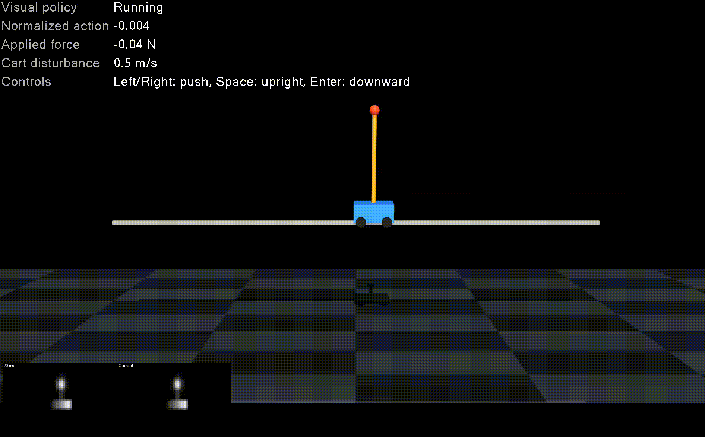

## Hi there 👋
I am a Electrical Engineering and Computer Science junior at Purdue University, expecting to graduate Spring 2028. My research interests are in developing AI systems capable of reasoning practically about real world environments, involving developing algorithms that enhance robotics control with greater physical reasoning, and developing computing systems capable of efficiently and practically executing complex AI models.

### Research Work

#### (First Author) HybridMimic: Hybrid RL-Centroidal Control for Humanoid Motion Mimicking
A flexible humanoid full body controller is augmented with a low level model based controller to give an RL trained policy network the ability to explicitly reason about contact states and ground reaction forces. The hybrid of RL and model based control is done in such a way to maximize computational efficiency and thus practicality.

Sim to Sim result illustrating ground reaction force reasoning:

Real world experiment:

[Paper]https://arxiv.org/abs/2603.06775
[Open Source Code]https://github.com/purdue-tracelab/hybrid_mimic

#### (Equal Contributor, First Author) Fully Optical Multilayer Neural Network for Controlling Dynamic Visuomotor System
Optical Neural Networks promises accurate, energy efficient, and high frequency method of computing. As such, Optical Neural Networks have emerged as a promising replacement for outscaling existing silicon processors for AI inference. Dynamic visuomotor control systems, with visual inputs and requirements for high frequency control, present an intriguing application for optical neural networks. Currently working on research developing a free space all-optical multi-layer neural network for controlling a nonlinear cart and pendulum (with swing up) from input images only.

### Resume
[Resume](tay3_main_resume.docx.pdf)
<!--
**SavvyProp/SavvyProp** is a ✨ _special_ ✨ repository because its `README.md` (this file) appears on your GitHub profile.

Here are some ideas to get you started:

- 🔭 I’m currently working on ...
- 🌱 I’m currently learning ...
- 👯 I’m looking to collaborate on ...
- 🤔 I’m looking for help with ...
- 💬 Ask me about ...
- 📫 How to reach me: ...
- 😄 Pronouns: ...
- ⚡ Fun fact: ...
-->
